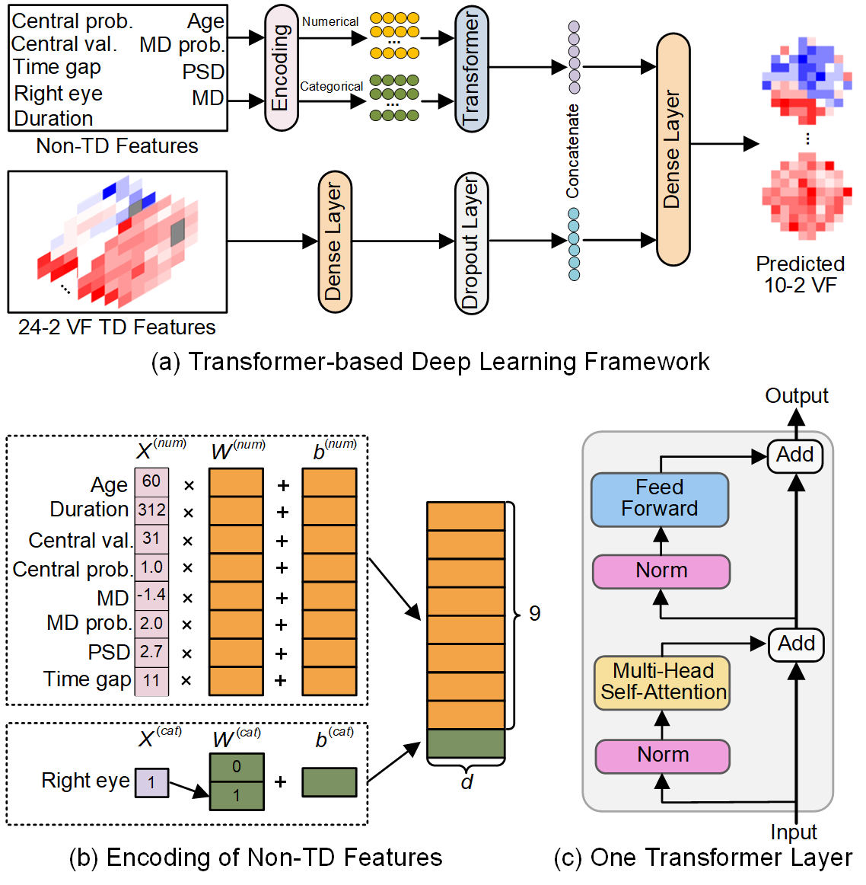
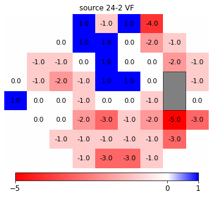
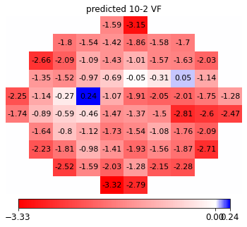

# VFTransformer

The code for the paper entitled [**Transformer-based Deep Learning Prediction of 10-Degree Humphrey Visual Field Tests from 24-Degree Data**].



## Requirements
Python 3.8 <br/>
tensorflow 2.4.0 <br/>
opencv-python 4.5.5

## Dataset

Here are sample codes to visualize the RNFLT map:
````
import tensorflow as tf
import os
from vf_tools import *
import pandas as pd

vfdata = np.load('vfdata.npy',allow_pickle=True)
age, righteye, duration, centralval, centralprob, md, mdprob, psd, timegap, tds = vfdata[1]
plot_vf(tds)
````


## Pretrained Model
Download the model via this [link](https://drive.google.com/file/d/1Sn7RVzeJvLAYwXF4Dy8a7lDANK13R8sK/view?usp=sharing). Unzip the file and put under the "checkpoint" folder.


## Use the Model
````
# prepare the data
test_dataset, tds24_test = prepare_data(vfdata)

# load the pretrained model
model = tf.keras.models.load_model('checkpoint/fttransformer')

# predict 10-2 VF
preds = model.predict((test_dataset, tds24_test))
vf10_pred = np.array(preds['output'])
                           
# visualize the source 24-2 VF and predicted 10-2 VF
plot_vf(tds24_test[1], title='source 24-2 VF')
plot_vf(vf10_pred[1], title='predicted 10-2 VF')
````

#### 10-2 VF prediction example: <br />



## Acknowledgement & Citation


Coming soon ...

